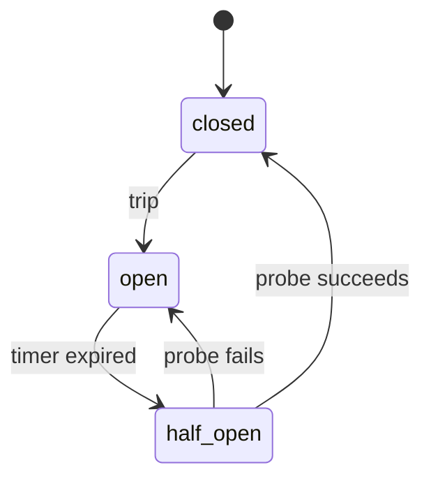

# Vor

A programming language for the BEAM with relations, constraints, and verifiable invariants.

[vorlang.org](https://vorlang.org)

## Why

The hardest bugs in distributed systems aren't logic errors — they're the ones where the code does something nobody intended because nobody wrote down what it should do. Design docs drift from code on day one. Formal specs sit in a separate repo that nobody updates after launch. The implementation becomes the only source of truth, and it's a source that can't answer "is this correct?"

Vor is a language where you declare what must be true — state machines, message protocols, safety invariants — and the compiler produces BEAM bytecode that satisfies those declarations. One artifact. No drift. The spec is the program.

## Example

A rate limiter in Vor ([full source](examples/rate_limiter.vor)):

```vor
agent RateLimiter(max_requests: integer, window_ms: integer) do

  extern do
    Vor.Examples.RateStore.increment(client: binary, window_ms: integer) :: integer
  end

  protocol do
    accepts {:request, client: binary, payload: term}
    emits {:ok, payload: term, remaining: integer}
    emits {:rejected, client: binary, retry_after: integer}
  end

  on {:request, client: C, payload: P} do
    current = Vor.Examples.RateStore.increment(client: C, window_ms: window_ms)
    if current <= max_requests do
      emit {:ok, payload: P, remaining: max_requests - current}
    else
      emit {:rejected, client: C, retry_after: window_ms}
    end
  end

  invariant "rate limit respected" monitored do
    forall C, Max
      where rate_limit(client: C, max_requests: Max)
      -> Vor.Examples.RateStore.count(client: C, window_ms: window_ms) <= Max
  end

end
```

The equivalent in Elixir would be a gen_server with manual rate tracking, `proplists` configuration, try/catch around external calls, and invariants that exist only as tests or comments — not as compiler-verified properties of the code.

## What's working

- Full compiler pipeline: `.vor` source -> Lexer -> Parser -> AST -> IR -> Erlang codegen -> BEAM binary
- Agents compile to OTP `gen_server` and `gen_statem`
- Parameterized agents with configuration passed at init
- Extern declarations for calling Erlang/Elixir from Vor agents (untrusted, try/catch wrapped)
- Relations with facts, state declarations, protocols, handlers with guards
- Multiple state fields — enum field as gen_statem State, others in Data map
- Bidirectional relation solver — equations inverted at compile time, queryable from any direction
- Richer expressions — variable binding, nested if/else, boolean conditions, comparison guards
- Transition with expressions — `transition count: count + 1`
- Compile-time safety verification — `proven` invariants checked against the state graph
- State graph extraction with text and Mermaid diagram output (`mix vor.graph`)
- Runtime liveness monitoring — stuck processes rescued by gen_statem state timeouts
- Safety and liveness invariant declarations with guarantee tiers (proven, checked, monitored)
- Protocol composition checking — `system` blocks verify connected agents have compatible protocols
- Protocol conformance checking
- Working rate limiter, circuit breaker, Raft consensus, G-Counter CRDT, and distributed lock examples
- Handler completeness checking — call handlers must emit on every code path
- Multi-agent system runtime — supervisor, registry, inter-agent send tested end-to-end
- Native map operations and min/max expressions
- Periodic timers (`every`) for gossip, heartbeats, cleanup
- Native map and list operations, min/max expressions
- Init handlers for startup logic, LWW merge for CRDTs
- Gleam extern support with type boundary validation
- Lightweight type tracking catches guaranteed crashes at compile time
- 296 tests passing, 9 property tests, zero compiler warnings
- [Step-by-step tutorial](docs/vor-tutorial.md) from Echo agent to multi-agent pipeline

## Verified state machine

The [circuit breaker example](examples/circuit_breaker.vor) declares a safety invariant: the open state must never forward requests. The compiler proves this at compile time by walking the state graph. A violation fails compilation with a clear error.



### Compiler verification

The safety verifier and graph extraction modules have TLA+ specifications
in `tla/` that formally define their correctness properties. TLC model
checking exhaustively verifies these properties for all possible inputs
within bounded size. See `tla/README.md` for details.

## What's coming
- Synthesis obligations (AI-assisted implementation)

## Try it

```
git clone git@github.com:vorlang/vor.git
cd vor
mix deps.get
mix test
```

Or run the rate limiter interactively:

```
iex -S mix

{:ok, r} = Vor.compile_and_load(File.read!("examples/rate_limiter.vor"))
{:ok, pid} = GenServer.start_link(r.module, [max_requests: 5, window_ms: 60_000])
GenServer.call(pid, {:request, %{client: "alice", payload: "hello"}})
# => {:ok, %{payload: "hello", remaining: 4}}
```

## Background

- [One-pager](docs/onepager.md) -- technical overview
- [Paradigm comparison](docs/comparison.md) -- Mainstream vs Vor

## License

MIT
